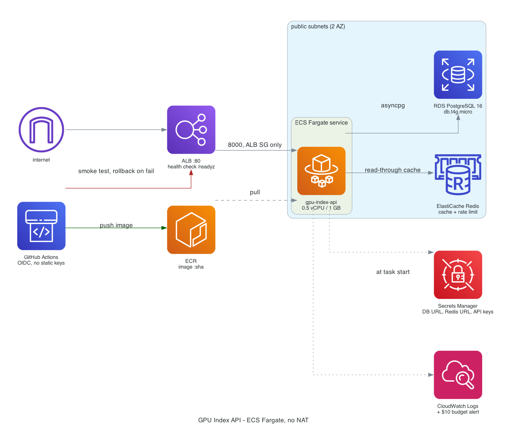

# GPU Index API

Async FastAPI service for GPU pricing intelligence and benchmark indexing. Ingests
price observations across providers and regions, serves latest-price and
price-per-throughput rankings over a 2M row dataset.

Built to production practices against synthetic data. The numbers below are
measured on the seeded dataset, not projections, and every one is reproducible
from this repo.



Request, ingest, and deploy/rollback flows: [docs/request-flow.md](docs/request-flow.md).

## Measured results

**Query tuning** (2,000,000 price points, 385 MB table, median of 5 runs)

| | Median latency |
|---|---|
| Hot query before indexing | 166.6 ms |
| Hot query after indexing | 24.2 ms |
| **Improvement** | **85.5%** |

Heap blocks read fell from 43,215 to 1,198 once both branches of the plan became
index-only scans with `Heap Fetches: 0`. Full plans in [docs/query-tuning.md](docs/query-tuning.md).

**Pagination** at depth 50,000

| Strategy | Before indexes | After indexes |
|---|---|---|
| `OFFSET 50000` | 76.3 ms | 3.2 ms |
| Keyset cursor | 41.1 ms | 0.7 ms |

**Load test** (20s closed loop, 2 uvicorn workers, local Postgres and Redis)

| Concurrency | Throughput | p50 | p95 | p99 | Errors | Cache hit ratio |
|---|---|---|---|---|---|---|
| 8 | 1,114 req/s | 6.8 ms | 8.3 ms | 13.8 ms | 0 | 99.7% |
| 20 | 544 req/s | 16.2 ms | 126.7 ms | 206.7 ms | 0 | 98.8% |

At concurrency 20 the service is saturated against 2 workers and the tail is
queue time, not query time. The p95 gap between the two rows is what saturation
looks like.

**Async ingestion fan-out** (50 simulated provider feeds, ~80ms each)

| Mode | Wall time | Speedup |
|---|---|---|
| Sequential | 3,872 ms | 1.0x |
| Concurrent, limit 8 | 570 ms | 6.8x |
| Concurrent, limit 32 | 192 ms | **20.1x** |

**Tests:** 47 passing, 95% coverage against an 85% gate.

## Stack

FastAPI, Pydantic v2, SQLAlchemy 2.0 async, asyncpg, Redis, Postgres 16,
Docker, Terraform, ECS Fargate, GitHub Actions.

## Running it

```bash
docker compose up -d postgres redis
pip install -e ".[dev]"
python scripts/seed.py --rows 2000000     # runs migrations, then seeds
python scripts/tune.py                     # regenerates docs/query-tuning.md
uvicorn app.main:app --reload
```

Reproduce the measurements:

```bash
pytest --cov=app --cov-fail-under=85
python scripts/bench_ingest.py --feeds 50 --latency-ms 80
RATE_LIMIT_REQUESTS=1000000 uvicorn app.main:app --workers 2 &
python tests/load/loadtest.py --concurrency 8 --duration 20
```

The load test raises the rate limit deliberately. Left at the default 120/min it
throttles its own traffic and the percentiles become meaningless, so the harness
fails the run if the error rate exceeds 1%.

## API

| Endpoint | Notes |
|---|---|
| `GET /v1/gpus` | Filter by vendor and VRAM |
| `GET /v1/gpus/{id}/prices` | Hot path. Latest per provider/region + 30d median. Cached |
| `GET /v1/gpus/{id}/prices/history` | Keyset paginated |
| `GET /v1/gpus/{id}/benchmarks` | Filter by workload and precision |
| `GET /v1/index/{workload}` | Price-per-throughput ranking. Cached |
| `POST /v1/ingest/prices` | Batch upsert, invalidates cache |
| `/healthz` `/readyz` `/metrics` | Liveness, readiness, Prometheus counters |

All `/v1` routes require `X-API-Key` and are rate limited per key.

## Design notes

**`DISTINCT ON` over window functions.** `ROW_NUMBER() OVER (PARTITION BY ...)`
sorts the full filtered set before discarding rows. `DISTINCT ON` consumes index
order and stops at the first row per group, which is why matching the index
column order to the `ORDER BY` eliminated the sort entirely.

**Covering indexes, not partial ones, on the hot path.** The partial index on
`availability = 'available'` measured *worse*, because the API passes
availability as a bind parameter and the planner cannot prove a partial
predicate holds for an unknown parameter. Carrying the column in `INCLUDE`
instead keeps the scan index-only. The `/v1/index` endpoint does use a partial
index, because there the filter is a literal.

**Planner cost settings are part of the tuning.** With the default
`random_page_cost = 4.0` Postgres assumes spinning-disk seeks and rejects the
index-only scan even after the index exists. The tuning script sets it to 1.1
for SSD-backed storage and applies it to both the before and after measurement,
so the reported delta isolates the indexes.

**Graceful degradation over strict correctness on the cache path.** A Redis
outage degrades to a direct database read and the rate limiter fails open.
Availability of the API matters more than cache hit ratio or perfect throttling.

**`/readyz` drives the load balancer, `/healthz` does not.** A task with a dead
database should leave the ALB pool but should not be killed and restarted, so
the container health check and the target group health check point at different
endpoints.

## Infrastructure

Terraform provisions ECS Fargate behind an ALB, RDS Postgres `db.t4g.micro`,
ElastiCache Redis `cache.t4g.micro`, ECR, and Secrets Manager. Roughly $0.09/hr,
about $0.40 for a 3 hour demo window.

Deliberately **no NAT Gateway**. It would be the largest line item at ~$33/month
and the resource most likely to survive a partial `destroy`. Tasks run in public
subnets with security groups admitting only the ALB, and the database is not
publicly routable. A long-lived production deployment would use private subnets
with VPC interface endpoints for ECR, Secrets Manager, and CloudWatch Logs.

A $10 AWS Budget ships with the stack, alerting at 25/50/100% actual and 80%
forecasted. The forecast alert is the one that matters: actual-spend alerts on a
$10 budget would not fire for days on a stack burning $0.09/hr.

```bash
cd terraform && terraform apply
# demo
terraform destroy
```

## CI/CD

`lint` → `test` → `security` → `deploy` → `smoke` → `rollback on failure`.

Blocking gates: ruff, mypy, 85% coverage, Bandit, Trivy on HIGH/CRITICAL,
gitleaks. AWS access is via GitHub OIDC with no static keys.

The deploy job captures the current task definition ARN *before* registering the
new revision, then runs smoke tests against the live ALB, including asserting
that an unauthenticated request returns 401. If any smoke test fails, the
rollback step redeploys the captured revision and fails the build.

## Deployment verification

Deployed to AWS and torn down on 2026-07-23. 31 resources created, all 31
destroyed, no orphans.

Live smoke tests against the ALB, all passing:

| Check | Result |
|---|---|
| `/healthz` | `{"status":"ok"}` |
| `/readyz` | `ready`, postgres + redis both ok |
| Unauthenticated request | 401 |
| Invalid API key | 401 |
| `/v1/gpus`, `/v1/gpus/{id}/prices`, `/v1/index/{workload}` | real data |
| Keyset pagination | cursor walk, no overlap |
| Validation envelope | 422 with stable field/message shape |

Cloud measurements on 250,000 seeded rows (`db.t4g.micro`):

| | Result |
|---|---|
| Hot query before indexing | 32.9 ms |
| Hot query after indexing | **9.0 ms (73% faster)** |
| `/v1/index` cold vs cached | 584 ms → 85 ms (**6.9x**) |
| Network RTT floor (`/healthz`) | 85 ms |

The RTT floor matters when reading the endpoint timings: client-observed latency
from outside the region is dominated by round trip, not query time.

This gap was found by deploying: the cloud hot path sat at ~170 ms because the
tuning indexes existed only in `scripts/tune.py`, so they were present in every
measurement and in no deployment. Fixed, see below.

## Schema and migrations

The DDL for the performance indexes lives in exactly one place,
[`app/db/indexes.py`](app/db/indexes.py), and is imported by both the Alembic
migration that creates them and the tuning script that drops and rebuilds them
to measure their effect. Neither can drift from the other.

```
0001_initial_schema     tables, FKs, natural-key constraint
0002_tuning_indexes     the five performance indexes + ANALYZE
```

The indexes are a separate revision on purpose, so the performance work is a
reviewable change rather than something buried in the initial schema.

```bash
alembic upgrade head       # build schema, including indexes
alembic downgrade 0001     # drop the indexes, keep the data
```

`scripts/seed.py` builds the schema by running the migrations rather than
`Base.metadata.create_all`, so a seeded database is constructed exactly the way
a deployed one is and every seed run exercises the migration path.

Six tests in `tests/integration/test_migrations.py` guard the arrangement: they
assert the migration imports the shared DDL rather than restating it, that drop
statements cover every index, and that the DDL applies cleanly against real
Postgres and is visible to the planner afterward.
