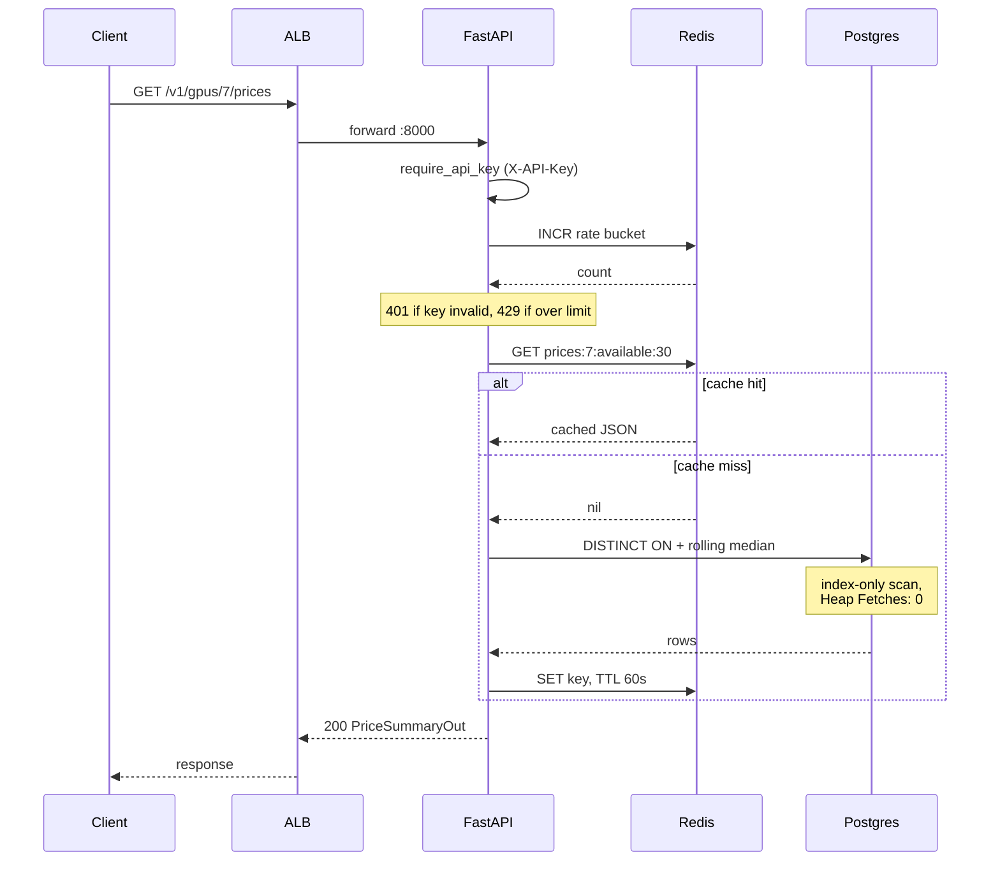
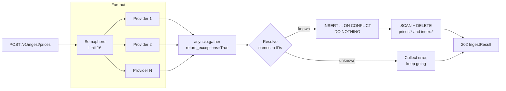
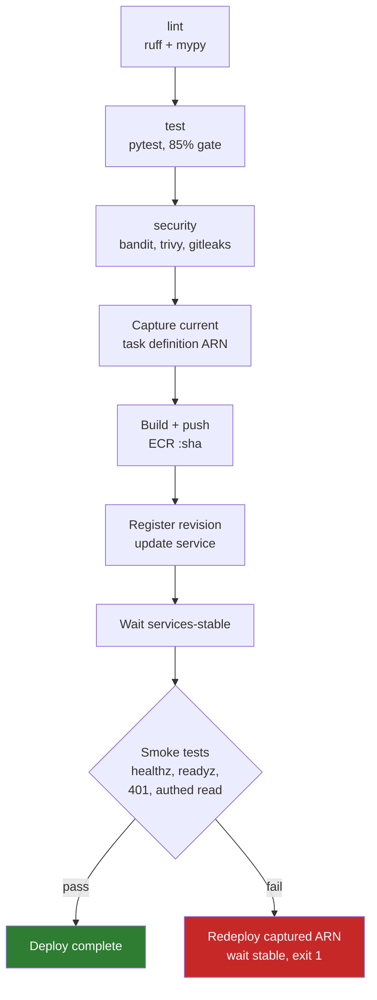

# Request Flow

## Read path

The hot path is `GET /v1/gpus/{id}/prices`. Auth and rate limiting run as
dependencies before the handler, so an unauthenticated or throttled request
never reaches Postgres.

A Redis outage does not fail the request. `read_through` catches the error,
increments `cache_errors_total`, and falls through to a direct database read.
The rate limiter likewise fails open. Availability of the API is worth more than
cache hit ratio or perfect throttling.

## Ingest path

Provider feeds are fetched concurrently under a bounded semaphore, then upserted
in one statement. Cache invalidation happens after the write, not before, so a
failed write cannot leave the cache empty and the database stale.

`return_exceptions=True` is deliberate: one provider returning garbage should not
sink the whole ingestion run. Unknown GPU or provider names are collected as
errors and reported in the response rather than raised.

Measured fan-out, 50 feeds at ~80ms each:

| Mode | Wall time | Speedup |
|---|---|---|
| Sequential | 3,872 ms | 1.0x |
| Concurrent, limit 8 | 570 ms | 6.8x |
| Concurrent, limit 32 | 192 ms | 20.1x |

## Deploy and rollback

The previous task definition ARN is captured **before** the new revision is
registered, so rollback always has a known-good target.

